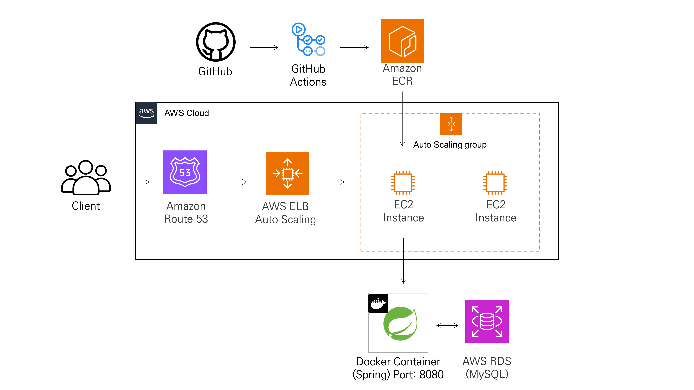
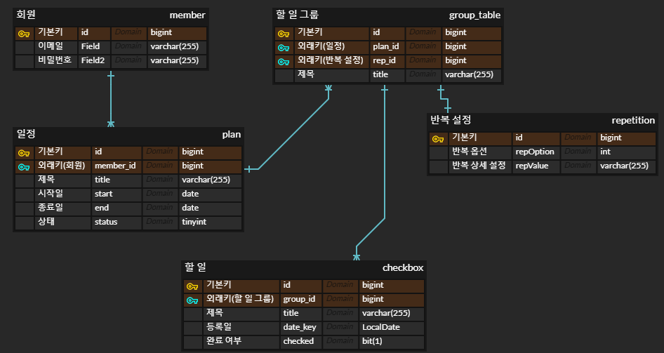
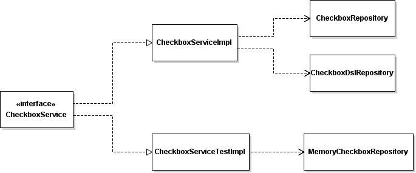
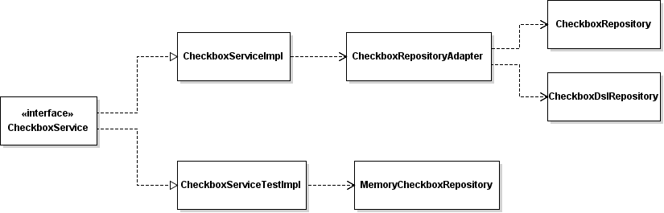

# PlanTodo
## 프로젝트 개요

### Contact
- Phone : 010-2301-5071
- Email : jojuyeon633@gmail.com

### Info
|항목|내용|
|----|---------|
|프로젝트 소개|투두리스트 웹 어플리케이션을 테마로 하는 HTTP API|
|개발 인원|총 1명|
|담당 역할|백엔드 API 개발 및 테스트, CI/CD 구성, DB 세팅 및 배포|
|개발 기간|2023-06 ~ 2023-08|
|성과 및 결과|기한 내 목표한 기능 구현 완료, CI/CD 및 실제 서버 배포 완료|

### Links
:octocat: [Github Link](https://github.com/yeonleaf/plantodo-renew)

:link: [배포 링크](https://plantodo.site/swagger-ui/index.html)

 
 
 

## 프로젝트 설명
### Skills
|카테고리|기술|
|----|-------|
|Backend|Spring Boot, JPA|
|Database|MySQL|
|Deploy|AWS EC2, AWS RDS, AWS ECR, Docker, Github Actions|
|etc|Swagger|

### Architecture

### ERD

### Feature
자세한 요청/응답 명세는 [링크](https://documenter.getpostman.com/view/16796529/2s9Y5SWRLp)를 참고

- 회원가입 / 로그인 POST API
- 일정 / 그룹 / 할일 CRUD HTTP API
- 날짜 / 기간 단위로 조회하는 Collection 조회 API

 
 
 

## 프로젝트에서 고민한 점
## Plantodo 백엔드 구현

### HTTP API에 하이퍼미디어 링크를 적용

- 기술 : Spring HATEOAS

    > RepresentationModelAssembler를 사용하면 컨트롤러에서 링크를 직접적으로 세팅할 필요가 없어서 사용
    

- 대상 : 단일 Domain을 대상으로 하는 HTTP API

    원래 목표는 모든 API에 하이퍼미디어 링크를 적용하는 것이었음. 하지만 여러 Domain을 조회하는 API의 경우 하이퍼미디어 링크를 적용하게 되면 구조가 복잡해져서 파악이 어려운 문제점이 있었음. 그래서 단일 Domain을 대상으로 하는 HTTP API에만 제한적으로 하이퍼미디어 링크를 적용함.

- 목적 : API를 Self-Descriptive하게 만들기
    

 

### JWT 토큰 인증 사용

- 기술 : JJWT(Java Json Web Token)

- 목적 : 추후 Load Balancing으로 트래픽을 분산할 경우에 대비해 확장성이 좋은 JWT 토큰 인증 방식을 사용함.

- 구현 : 직접 구현

    로그인 시 jwtProvider 클래스로 Access Token을 발급. 추후 Refresh Token 도입 예정.

    

    회원가입, 로그인 API를 제외한 모든 요청에 올바른 JWT Token이 있는지 인터셉터 단에서 확인하고 검증이 완료되는 경우에만 컨트롤러로 요청을 넘김.
    

 

### DTO/Entity 변환에 타입 컨버터를 적용
- 기술 : Spring Converter 
- 대상 : 요일을 내부 값으로 사용하는 `List<String>` 필드
- 목적 : JPA @ElementCollection을 제거해서 값 타입 컬렉션을 사용할 필요가 없게 함.
    
    원래는 DTO와 Entity에서 동일한 `List<String>` 형태의 필드를 사용. Entity에서는 JPA의 @ElementCollection을 사용해서 `List<String>`을 값 타입 컬렉션 형태로 저장하고 관리.

    

    @ElementCollection 사용에는 여러 문제점이 있어 제거할 필요성을 느낌.

    - 값 타입 컬렉션은 엔티티가 아니라 별도의 테이블로 관리됨. 어플리케이션 단에서 스키마를 예측하기가 어려워 직접 MySQL 콘솔로 들어가서 생성된 테이블의 스키마를 확인해야 하는 불편함이 있었음.
    - 값 타입 컬렉션의 변경 감지와 관련해 한계점 존재. 내부 값의 수정을 감지하지 못하는 경우 생김.
    - 값 타입 컬렉션의 불변성을 유지하기 위해 전체 컬렉션을 대체하는 방식을 사용해야 함. (변경이 빈번하게 발생하는 경우 성능에 영향을 미칠 수 있음)

- 구현 : 
    DTO에서 `List<String>` 타입을 그대로 사용하되 Entity 필드는 `String` 타입으로 변경(0과 1로 구성된 비트 문자열). DTO와 Entity를 변환하는 과정에 타입 컨버터를 적용.

    

 
 

## Plantodo 테스트
### TDD를 통해 총 337개의 통합 테스트와 유닛 테스트를 설계 및 구현

- 컨트롤러 유닛 테스트 + 샘플 코드

    서비스 계층의 동작을 MockBean을 사용해 대체. 서비스의 리턴값이 정상일때와 비정상일 때를 구분해 컨트롤러의 응답값을 검증. 검증 시 가독성이 좋고 복잡한 구조를 탐색하기 좋은 jsonPath를 사용.
    
    

- 서비스 유닛 테스트 + 샘플 코드

    별도의 Config 파일에 테스트용 리포지토리와 테스트용 서비스 객체를 빈으로 등록해 사용. 서비스 메소드의 응답값을 AssertJ 구문을 사용해 검증함. @AfterEach를 사용하여 테스트 후 롤백을 해서 각각의 테스트가 독립적으로 진행되도록 보장함.

    

    
    

 

### 리포지토리에 메모리 대역 적용

- 목적 :
대부분의 테스트가 통합 테스트로 이루어져 있어 속도가 느렸음. 리포지토리에 대역을 사용하는 유닛 테스트 위주로 서비스 계층의 테스트를 재구성해 전체 테스트 속도가 빨라지기를 기대함.
- 구현 : HashMap을 사용해 DB를 대체하고 ID는 직접 관리함.
    

 

### 리포지토리에 어댑터 패턴 적용
- 목적 : 테스트 서비스와 실제 서비스에서 의존하는 리포지토리 개수에 차이가 있어 테스트 서비스가 실제 서비스를 완전히 반영하지 못하는 문제를 해결

    TDD를 하면서 리포지토리에 메모리 대역을 사용하는 테스트용 구현 클래스를 만듦. 대부분 실제 서비스에도 하나의 리포지토리를 사용해 문제가 없었음. 하지만 Checkbox의 경우 필터링하거나 fetch join이 필요한 부분을  DslRepository로 분리해 두 개의 리포지토리를 하나의 서비스에서 사용하고 있었음. 
    

- 구현 : 두 리포지토리에 어댑터를 연결해 서비스 입장에서는 하나의 리포지토리에만 의존하도록 함. 

    서비스 구현체와 리포지토리 구현체 간의 의존도가 낮아져 추후 다른 리포지토리 구현체를 사용할 때 쉽게 추가할 수 있게 됨.  
    

 
 

## PlanTodo 배포 / 문서화
### Auto Scaling
- 목적 : 인스턴스가 비정상적으로 종료되거나 실패하는 경우 새로운 인스턴스로 대체해 고가용성을 제공. 추후 트래픽이 발생하게 되면 EC2 인스턴스의 CPU 사용률이 80%를 넘었을 때 인스턴스를 확장해 부하를 분산할 예정.
- 관련 링크 : [TroubleShooting Link](https://erratic-leo-4a8.notion.site/AWS-auto-scaling-e30358bbf9f54bf2b12e01b40ab9ab8e?pvs=4)

### CI/CD
- 기술 : Docker, Github Actions, ECR 
    
    Docker
    > 코드 릴리즈를 신속하게 배포할 수 있고 이미지만 배포해도 간편하게 애플리케이션을 실행할 수 있어서 사용. 

    Github Actions
    > 현재 Github외에 다른 버전 관리 툴을 사용하지 않고 프로젝트의 규모가 작은 편. 그리고 Github Actions에서 Free runner를 제공해 CI/CD를 위한 별도의 서버를 구성할 필요가 없어 Github Actions를 사용.

    ECR
    > EC2이 AWS IAM을 통해 편리하게 보안 권한을 관리할 수 있어 사용.

- 목적 : Docker 이미지를 빌드하기부터 EC2에 배포하기까지의 과정을 자동화하여 배포 중 실수 가능성과 배포에 드는 시간을 줄임.

- 구현 : `Git Pull Request` - `Gradle Test` - `Gradle Build` - `Docker Image Build and push to ECR Repository` 순으로 CI/CD 진행.
- 관련 링크 :
    [TrobleShooting Link](https://erratic-leo-4a8.notion.site/Github-Actions-CI-CD-troubleshoot-6e530bfa10e34e219080170967bc268d?pvs=4)

 
 
 

## 앞으로 개선할 점
- (진행 중) DB 다중화. 현재 로컬에서 Docker를 사용해 두 개의 MySQL 컨테이너를 띄워 Master-Slave Replication을 구현 중. 구현에 익숙해지고 나면 프로젝트에도 적용할 예정.
- JWT 토큰 인증 과정에 Access Token을 적용하게 되면 탈취를 막기 위해 만료 시간을 짧게 유지하게 됨. 이 문제를 해결하기 위해 Refresh Token을 도입. 